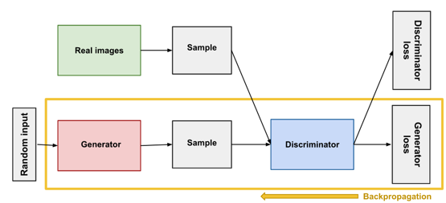

## About the Project

During my tenure from September 2021 to April 2022 in Antigonish, Canada, I undertook an extensive research project focusing on the implementation, creation, and development of Generative Adversarial Networks (GANs) within the domains of Augmentation and Medical Imaging. The primary objective of this project was to explore the potential of GANs in these areas and assess their impact.

To achieve this, I designed and developed a robust research framework. As part of this framework, I implemented a PyTorch Lightning Deep Convolutional GAN (DCGAN) to fine-tune and train on the HMDB51 dataset. The dataset, widely recognized for its use in Human Action Recognition, served as a foundation for generating augmented videos through the power of GANs.

By utilizing the capabilities of PyTorch Lightning, I created a scalable and efficient training pipeline for the DCGAN model. This involved carefully selecting hyperparameters, optimizing the network architecture, and employing advanced training techniques to ensure the generation of high-quality augmented videos.

To evaluate the effectiveness and performance of the generated augmented clips, I integrated PyTorchVideo's pre-trained classifier into the research framework. This classifier, designed specifically for action recognition tasks, enabled me to measure and compare the performance of the augmented clips with respect to their corresponding original clips. This comprehensive evaluation process provided valuable insights into the fidelity and quality of the generated augmentations.

Throughout this project, I gained extensive experience in implementing and fine-tuning GAN models, leveraging the power of PyTorch Lightning to facilitate efficient training. Additionally, I acquired proficiency in utilizing PyTorchVideo to assess the performance of augmented clips, ensuring the accuracy and effectiveness of the generated outputs.

By successfully trying to complete this research project, I not only demonstrated my proficiency in understanding and implementing GANs for Augmentation and Medical Imaging but also deepened my understanding of these domains. The skills and knowledge acquired during this endeavor will undoubtedly contribute to my professional growth and enable me to make significant contributions in the field of artificial intelligence and computer vision.

### Built With

- [](https://www.python.org/downloads/)
- [](https://pytorch.org/get-started/locally/)
- [](https://www.pytorchlightning.ai/index.html)

## Getting Started

### Prerequisites

To run this project, you will need:

- Python installed on your development machine. To install [Python](https://www.python.org/downloads/), follow the link. By having Python installed you will also have pip installed.
- Any editor of your choice. Personally, I use [Visual Studio Code](https://code.visualstudio.com/download) for all my projects.

### Installation

1. Clone the repo
   ```markdown
   https://github.com/bhaven123/Project-GANs
   ```
2. Install project dependencies
   ```markdown
   pip install -r requirements.txt
   ```

## Usage

- To run the model, simply type the following command in a terminal inside the project root folder.
  ```
  python3 main.py --gpus=1 --max_epochs=250 --dim=4 --latent_dim=4 --fmaps=32 --batch_size=4 --learning_rate=1e-5 --label_smooth=0.2
  ```

### Screenshots



### Code files

- dcgan.py => The DCGAN module.
- discriminator.py & generator.py => The Discriminator and Generator for the DCGAN.
- loader.py => The Data Loader for HMDB51 dataset.
- load_HMDB51.py => Creating and caching the dataset with the help of torchvision.datasets HMDB51 loader.
- main.py => Training the DCGAN on HMDB51 dataset.
- image_sampler.py => To generate and log images created by the model to visualize in Tensorboard.
- flash_video_classifier => Pretrained Video Classifier to test the Augmentation component.
- video_classifiaction.pt => Finetuned and pretrained video classifier saved model file.

### Folders

- Results -> Videos generated by the GAN after changing some hyperparameters.

## Contact

- Bhaven Naik - [naikbhaven11@gmail.com](mailto:naikbhaven11@gmail.com) | Portfolio - [https://bhaven-naik.com/](https://bhaven-naik.com/)
- Project Link: [https://github.com/bhaven123/Project-GANs](https://github.com/bhaven123/Project-GANs)

## Acknowledgements

- [PyTorchVideo](https://pytorchvideo.org/)
- [Joblib](https://joblib.readthedocs.io/en/latest/installing.html)
- [DCGAN](https://pytorch.org/tutorials/beginner/dcgan_faces_tutorial.html)
